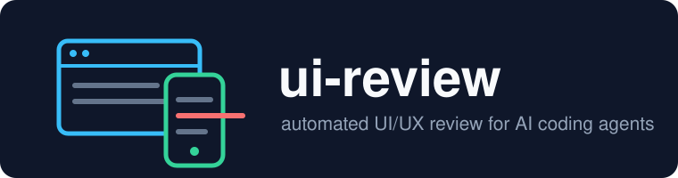

<p align="center">
  
</p>

<p align="center">
  <a href="https://github.com/cdmx-in/ui-review/releases"></a>
  <a href="LICENSE"></a>
  <a href="https://github.com/cdmx-in/ui-review/stargazers"></a>
  
  <a href="https://github.com/vercel-labs/agent-browser"></a>
</p>

<p align="center">
  
</p>

# ui-review

A [Claude Code](https://claude.com/claude-code) skill that reviews any web page or app for UI/UX defects using the [agent-browser](https://github.com/vercel-labs/agent-browser) CLI.

It checks every common breakpoint (mobile 360, tablet 768, laptop 1366, desktop 1920) for:

- Text overflow, clipping, and truncation without ellipsis
- Awkward wrapping (multi-line buttons, orphan words)
- Horizontal scroll and the elements causing it
- Overlapping elements
- Tap targets smaller than 24px (WCAG 2.5.8)
- Broken, stretched, or container-overflowing images
- Placeholder leakage (`undefined`, `NaN`, `[object Object]`, lorem ipsum)
- Missing viewport meta, tiny font sizes
- Console errors and failed network requests
- Dark-mode regressions (screenshot diff)

Programmatic checks run in-page via `eval`; screenshots are then visually inspected by the model for things JS can't judge (misalignment, bad truncation, contrast). When reviewing a local dev server with the source code present, findings are mapped back to `file:line` and can be fixed in place.

**Thorough mode** (`/ui-review thorough`): three deep scenario packs beyond the standard sweep — interaction/state QA (focus indicators, modal focus traps, silent network failures, double-submit, empty/loading states), content stress (long-string and i18n injection, 200% zoom / 320px reflow per WCAG 1.4.4/1.4.10, 0/1/1000-item lists), and rendering environments (dark-mode contrast, reduced motion, sticky-header occlusion, hi-DPI blur, font loading).

**Regression mode**: `/ui-review baseline` stores per-breakpoint screenshots + defect JSON in `.ui-review/` (commit it). Later runs pixel-diff and JSON-diff against the baseline and only spend vision tokens on breakpoints that actually changed — unchanged pages cost near zero.

## 🚀 Install

1. Install agent-browser (once):

   ```bash
   npm i -g agent-browser && agent-browser install
   ```

2. In any Claude Code session, run:

   ```
   /plugin marketplace add cdmx-in/ui-review
   /plugin install ui-review@ui-review
   ```

   Or with the [skills](https://skills.sh) CLI:

   ```bash
   npx skills add cdmx-in/ui-review
   ```

That's it. No tokens or accounts needed — it installs straight from this public GitHub repo.

<details>
<summary>Alternative: manual install via git clone</summary>

```bash
git clone https://github.com/cdmx-in/ui-review /tmp/ui-review
cp -r /tmp/ui-review/skills/ui-review ~/.claude/skills/ui-review
```

Windows (PowerShell):

```powershell
git clone https://github.com/cdmx-in/ui-review "$env:TEMP\ui-review"
Copy-Item -Recurse "$env:TEMP\ui-review\skills\ui-review" "$env:USERPROFILE\.claude\skills\ui-review"
```

Claude Code auto-discovers skills in `~/.claude/skills/`.
</details>

## 🔍 Use

In any Claude Code session:

```
/ui-review http://localhost:3000
```

or just say "review the UI", "check responsiveness of my app", "find layout bugs on staging.example.com". With no URL, it probes common local dev ports (3000, 5173, 8080, 4200). Ask for fixes ("review the UI and fix what you find") and it will patch the source, hot-reload, and re-verify.

### 🧭 Modes

| Mode | Invoke | What it does |
|---|---|---|
| **Standard** | `/ui-review [url]` | Sweep 4 breakpoints: in-page defect detection + full-page screenshots + console/network errors, then visual inspection. Writes `.ui-review/<page>/REPORT.md`. |
| **Baseline** | `/ui-review baseline [url]` | Store per-breakpoint screenshots + defect JSON in `.ui-review/` (commit it). Known defects go in `KNOWN.md` so they aren't re-reported. |
| **Compare** | `/ui-review [url]` (baseline exists) | Pixel-diff + JSON-diff against the baseline; only inspects breakpoints that changed. Reports regressed / fixed / unchanged. |
| **Thorough** | `/ui-review thorough [url]` | Standard sweep + deep scenario packs: interaction/state QA, content & i18n stress injection, rendering environments. |

### 📋 Example output

See [examples/demo/REPORT.md](examples/demo/REPORT.md) — a real run against [a deliberately broken page](examples/demo/demo.html): the detector catches the fixed-width hero forcing horizontal scroll, missing viewport meta, `NaN`/`undefined` leaking into copy, clipped German heading, an 18px close button, a broken image, a wrapping button label, and 10px text — each with severity, source line, and a one-line fix.

## 🤝 Works with other agents

Nothing here is Claude-specific: the skill is a standard [SKILL.md](https://github.com/anthropics/skills) plus one JavaScript file, and the only dependency is the agent-browser CLI. Any SKILL.md-compatible agent (Codex, Cursor, Gemini CLI, Windsurf, ...) can use it — point your agent's skills directory at `skills/ui-review/`.

## 🛠 Troubleshooting

- **`agent-browser: command not found`** — `npm i -g agent-browser && agent-browser install` (downloads Chrome for Testing on first run). Diagnose anything else with `agent-browser doctor`.
- **`a11y` or `vitals` returns `{"error":"Unknown command...","success":false}` or generic help** — your agent-browser build predates that command. These steps are optional; the skill skips them. `agent-browser upgrade` to get them.
- **Screenshots are blank / page never loads** — the target is probably behind auth. Log in once with `agent-browser auth save` or reuse cookies via `agent-browser state save/load`.
- **Windows** — commands run fine from PowerShell or Git Bash; the skill uses forward-slash paths throughout.

## 📁 Layout

```
skills/ui-review/SKILL.md      # the skill definition Claude Code follows
skills/ui-review/scripts/      # in-page defect detector (eval --stdin)
skills/ui-review/references/   # thorough-mode scenario packs with detection recipes
.claude-plugin/                # plugin + marketplace manifests
```

## 📄 License

MIT © [Codemax IT Solutions Pvt. Ltd.](https://cdmx.in)
